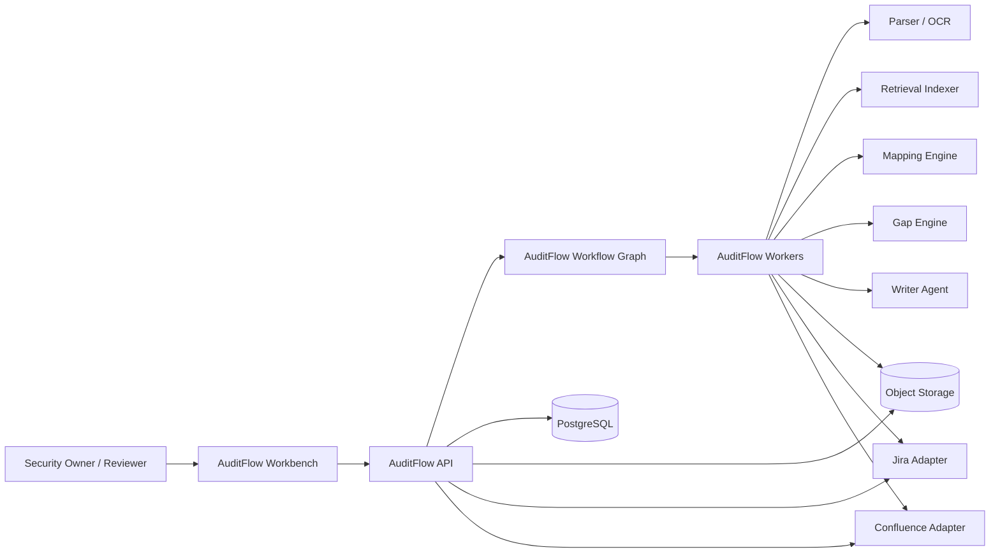

# AuditFlow Architecture

- Version: v0.1
- Date: 2026-03-16
- Scope: `SOC 2` evidence management workflow built on the shared platform kernel

## 1. Architecture Summary

`AuditFlow` is a domain module on top of the shared platform kernel. It does not own authentication, workflow persistence, queueing, or model routing. It owns the `SOC 2` domain model, evidence pipeline, control mapping logic, reviewer workbench behavior, and audit package generation.

v1 is optimized for:

1. `文件上传 + Jira + Confluence`
2. Reviewer-driven acceptance and correction
3. Strong evidence provenance
4. Async processing of all heavy tasks

## 2. Domain Design Drivers

1. Every conclusion must be traceable to source evidence
2. Control coverage must be queryable in near real time
3. Reviewer corrections must become reusable feedback
4. Large imports cannot block UI requests
5. Export generation must be reproducible from a known snapshot

## 3. Bounded Context and Dependencies

### AuditFlow-Owned Domain Capabilities

1. Audit workspace and cycle lifecycle
2. `SOC 2` control catalog and control status aggregation
3. Evidence ingestion and normalization
4. Evidence-to-control mapping
5. Gap detection and remediation suggestion
6. Reviewer workbench and decisions
7. Narrative and export generation

### Shared Platform Dependencies

1. Auth and RBAC
2. LangGraph runtime and approval tasks
3. Object storage and artifact service
4. Connector framework
5. Memory and retrieval foundation
6. Replay and evaluation infrastructure

## 4. Context Diagram

## 5. Major Components

### 5.1 Workspace and AuditCycle Service

Responsibilities:

1. Create and manage organization-scoped audit workspaces
2. Create audit cycles with period, owner, and source-system metadata
3. Track cycle state: `draft`, `ingesting`, `reviewing`, `ready_for_export`, `exported`
4. Expose control coverage summaries and status counts

### 5.2 Evidence Ingestion Service

Responsibilities:

1. Accept uploads and external import requests
2. Persist raw files and upstream references
3. Create ingestion jobs and record source metadata
4. Detect duplicates using upstream IDs and content fingerprints

### 5.3 Parsing and Normalization Pipeline

Responsibilities:

1. Extract text from `PDF`, `DOCX`, `PNG/JPG`, and `CSV`
2. OCR image-based evidence
3. Split extracted text into semantic chunks
4. Classify evidence type and freshness
5. Store chunk embeddings and searchable metadata

### 5.4 Mapping Engine

Responsibilities:

1. Retrieve candidate controls and prior accepted patterns
2. Generate candidate `EvidenceMapping` records
3. Attach confidence, rationale, and citation spans
4. Rank mappings for reviewer queue ordering

### 5.5 Gap Engine

Responsibilities:

1. Detect unmapped controls
2. Detect stale, insufficient, or conflicting evidence
3. Suggest likely owner and remediation next step
4. Produce cycle-level risk summary

### 5.6 Reviewer Workbench Service

Responsibilities:

1. Serve review queue ordered by severity and confidence
2. Render source evidence with citation highlights
3. Accept reviewer actions: `accept`, `reassign`, `reject`, `needs_more_evidence`
4. Persist reviewer comments and feedback labels

### 5.7 Narrative and Export Service

Responsibilities:

1. Generate control-level narratives from accepted evidence only
2. Compile cycle summary and gap register
3. Build versioned audit packages
4. Store exports as immutable artifacts

## 6. Domain Data Model

| Entity | Purpose |
| --- | --- |
| `audit_workspace` | Top-level product container for an organization |
| `audit_cycle` | A single SOC 2 preparation period |
| `control_catalog` | SOC 2 controls and control metadata |
| `audit_control_state` | Cycle-specific state of each control |
| `evidence_source` | Upload, Jira, or Confluence source registration |
| `evidence_item` | Canonical evidence record |
| `evidence_chunk` | Searchable chunk with citation offsets |
| `evidence_mapping` | Evidence-to-control candidate or accepted mapping |
| `gap_record` | Missing, stale, conflicting, or weak coverage |
| `review_decision` | Reviewer action and comment |
| `audit_narrative` | Generated control or cycle narrative |
| `audit_package` | Export snapshot and manifest |

### Key Fields

1. `evidence_item`
   - `source_type`
   - `source_locator`
   - `captured_at`
   - `fresh_until`
   - `evidence_type`
   - `fingerprint`
2. `evidence_mapping`
   - `control_id`
   - `status`
   - `confidence`
   - `rationale`
   - `citation_refs`
   - `proposed_by_run_id`
3. `gap_record`
   - `gap_type`
   - `severity`
   - `owner_hint`
   - `recommended_action`
4. `review_decision`
   - `decision`
   - `reviewer_id`
   - `comment`
   - `feedback_tags`

## 7. Workflow Graph

### 7.1 States

The v1 graph is fixed as:

1. `workspace_setup`
2. `ingestion`
3. `normalization`
4. `mapping`
5. `challenge`
6. `human_review`
7. `package_generation`
8. `exported`

### 7.2 State Responsibilities

1. `workspace_setup`
   Validates cycle metadata and source connections.
2. `ingestion`
   Registers raw files and external source pulls as ingest jobs.
3. `normalization`
   Produces structured evidence items and searchable chunks.
4. `mapping`
   Generates candidate evidence mappings and control state updates.
5. `challenge`
   Runs skeptic checks for weak or conflicting claims.
6. `human_review`
   Waits for reviewer decisions on flagged mappings and gaps.
7. `package_generation`
   Generates narratives and export package from approved snapshot.
8. `exported`
   Marks package immutable and ready for download/share.

### 7.3 Pause and Resume Rules

1. Graph pauses on reviewer-required approvals
2. Import failures do not cancel the cycle; they create partial-ingestion warnings
3. Export can only run on an explicit cycle snapshot version

## 8. Async Job Design

### Job Types

1. `auditflow.import.pull_external`
2. `auditflow.import.parse_file`
3. `auditflow.import.ocr_image`
4. `auditflow.index.embed_chunks`
5. `auditflow.map.generate_candidates`
6. `auditflow.gap.detect`
7. `auditflow.narrative.generate`
8. `auditflow.export.build_package`

### Queue Strategy

1. `critical`
   Reviewer-triggered re-runs and export build
2. `default`
   Mapping, gap detection, narrative generation
3. `bulk`
   Large file parsing and re-indexing

### Idempotency

1. File parse jobs keyed by evidence source fingerprint
2. Mapping jobs keyed by `audit_cycle_id + evidence_version + model_config_version`
3. Export jobs keyed by `audit_cycle_id + approved_snapshot_version`

## 9. Retrieval and Memory

### Retrieval Strategy

All reviewer-facing and agent-facing retrieval uses hybrid search:

1. Structured filters from PostgreSQL
2. Full-text search on parsed content
3. Semantic similarity with `pgvector`

### Memory Layers

1. `Organization memory`
   Accepted evidence patterns, reviewer preferences, system glossary
2. `Cycle memory`
   Current decisions, pending evidence requests, freshness warnings
3. `Mapping memory`
   Historical accepted mappings used as ranking hints, not as hard truth

### Retrieval Inputs

The mapping engine pulls from:

1. Relevant control descriptions
2. Similar accepted evidence from the same organization
3. Same-source historical evidence patterns
4. Reviewer corrections for the same control family

## 10. API Surface

### External REST Endpoints

1. `POST /api/v1/auditflow/workspaces`
2. `POST /api/v1/auditflow/cycles`
3. `GET /api/v1/auditflow/cycles/:cycleId/dashboard`
4. `POST /api/v1/auditflow/cycles/:cycleId/imports`
5. `GET /api/v1/auditflow/cycles/:cycleId/controls`
6. `GET /api/v1/auditflow/evidence/:evidenceId`
7. `GET /api/v1/auditflow/review-queue`
8. `POST /api/v1/auditflow/mappings/:mappingId/review`
9. `POST /api/v1/auditflow/gaps/:gapId/resolve`
10. `POST /api/v1/auditflow/cycles/:cycleId/exports`
11. `GET /api/v1/auditflow/exports/:packageId`

### Domain Events

1. `auditflow.import.accepted`
2. `auditflow.evidence.normalized`
3. `auditflow.mapping.generated`
4. `auditflow.mapping.flagged`
5. `auditflow.gap.detected`
6. `auditflow.review.recorded`
7. `auditflow.package.ready`

## 11. Frontend Workbench Architecture

### Main Screens

1. `Workspace Setup`
2. `Cycle Dashboard`
3. `Evidence Inbox`
4. `Control Coverage Matrix`
5. `Reviewer Queue`
6. `Audit Package Center`

### Key UI Modules

1. `EvidenceViewer`
   Side-by-side source preview with citation spans
2. `ControlPanel`
   Control description, accepted evidence, pending gaps
3. `ReviewActionBar`
   Reviewer decision controls and comment capture
4. `GapBoard`
   Gap severity grouping and owner suggestions
5. `ExportStatusPanel`
   Export progress, artifact history, and package manifest

### Live Updates

1. Ingestion progress
2. Mapping completion counts
3. Reviewer queue changes
4. Export build progress

All live updates flow through SSE from the shared platform event stream.

## 12. Security and Governance

1. Only `reviewer` or stronger roles can accept or reject mappings
2. Raw evidence download is permissioned separately from control review
3. Export packages are immutable artifacts once generated
4. Narrative generation reads only `accepted` mappings by default
5. Reviewer comments are part of the audit trail and cannot be hard deleted

## 13. Failure Modes and Recovery

1. OCR failure
   Mark evidence as `parse_failed`, allow manual re-run or manual text attachment
2. Connector failure
   Keep cycle active, surface source-level warning, and continue with other evidence
3. Low-confidence mapping burst
   Route all affected controls into reviewer queue without auto-accept
4. Export failure
   Preserve approved snapshot, rerun only the export phase

## 14. Testing and Evaluation

### Required Test Layers

1. Parser and chunker unit tests
2. Connector contract tests for Jira and Confluence
3. Mapping schema and citation validation tests
4. Reviewer workflow integration tests
5. Full-cycle replay tests from import to export

### Offline Evaluation

1. Control mapping precision/recall
2. Gap detection accuracy
3. Narrative faithfulness against accepted evidence
4. Reviewer acceptance delta by prompt/model version

### Release Gate

No model or prompt change ships if:

1. Mapping precision regresses beyond threshold
2. Citation validation fails
3. Narrative contains unsupported claims

## 15. Implementation Order

1. Audit workspace, cycles, and control catalog
2. File upload and raw artifact persistence
3. Parsing, chunking, and indexing pipeline
4. Mapping engine and reviewer queue
5. Gap engine
6. Narrative and export package service
7. Replay and feedback loops
