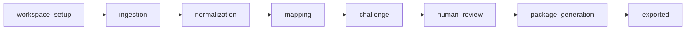

# AuditFlow Workflow Contracts

- Version: v0.1
- Date: 2026-03-16
- Scope: `AuditFlow` LangGraph state, node contracts, specialist agents, and recovery rules

## 1. Contract Summary

This document defines the executable workflow protocol for the `AuditFlow` domain.

The v1 graph is:

1. `workspace_setup`
2. `ingestion`
3. `normalization`
4. `mapping`
5. `challenge`
6. `human_review`
7. `package_generation`
8. `exported`

The workflow is optimized for:

1. Long-running evidence ingestion
2. Citation-backed mapping proposals
3. Reviewer-driven convergence
4. Snapshot-bound export generation

## 2. Top-Level State Objects

### 2.1 `AuditCycleWorkflowState`

All AuditFlow nodes operate on the following domain state patch over the shared workflow envelope.

| Field | Type | Required | Purpose |
| --- | --- | --- | --- |
| `audit_workspace_id` | `UUID` | Yes | Audit workspace root |
| `audit_cycle_id` | `UUID` | Yes | Cycle root |
| `cycle_status` | `string` | Yes | Mirrors `audit_cycle.status` |
| `working_snapshot_version` | `integer` | Yes | Snapshot version for current run |
| `requested_source_ids` | `UUID[]` | No | Import sources targeted by current run |
| `parsed_evidence_ids` | `UUID[]` | Yes | Evidence normalized in this run |
| `failed_source_ids` | `UUID[]` | Yes | Sources that failed normalization |
| `proposed_mapping_ids` | `UUID[]` | Yes | Mappings created in this run |
| `flagged_mapping_ids` | `UUID[]` | Yes | Mappings escalated by challenge node |
| `open_gap_ids` | `UUID[]` | Yes | Gaps created or still blocking |
| `review_blocker_count` | `integer` | Yes | Pending review work gating export |
| `narrative_ids` | `UUID[]` | Yes | Draft narratives for this snapshot |
| `package_id` | `UUID|null` | No | Current export package if requested |
| `partial_ingestion` | `boolean` | Yes | True when some sources failed |
| `export_requested` | `boolean` | Yes | True when export should be built |

### 2.2 `ReviewBlocker`

Used inside state to summarize why `human_review` cannot finish.

```json
{
  "kind": "mapping",
  "id": "uuid",
  "severity": "high",
  "reason_code": "conflicting_evidence"
}
```

## 3. Specialist Agent Contracts

### 3.1 `collector_agent`

Purpose:

1. Derive normalized metadata from source payloads
2. Produce evidence summaries
3. Propose evidence type and freshness hints

Input context:

1. Raw source content or extracted text
2. Workspace/cycle metadata
3. Allowed evidence types

Structured output:

```json
{
  "normalized_title": "Quarterly Access Review",
  "evidence_type": "ticket",
  "summary": "Quarterly user access review completed for production systems.",
  "captured_at": "2026-03-10T09:00:00Z",
  "fresh_until": "2026-06-10T09:00:00Z",
  "citations": []
}
```

### 3.2 `mapper_agent`

Purpose:

1. Retrieve candidate controls
2. Propose evidence-to-control mappings
3. Return rationale and citation refs

Structured output:

```json
{
  "mapping_candidates": [
    {
      "control_id": "uuid",
      "confidence": 0.84,
      "ranking_score": 0.91,
      "rationale": "Evidence shows a completed access review.",
      "citation_refs": [
        {
          "kind": "evidence_chunk",
          "id": "uuid"
        }
      ]
    }
  ]
}
```

### 3.3 `skeptic_agent`

Purpose:

1. Challenge weak mappings
2. Detect stale, insufficient, or conflicting evidence
3. Propose gap creation inputs

Structured output:

```json
{
  "mapping_flags": [
    {
      "mapping_id": "uuid",
      "issue_type": "conflicting_evidence",
      "severity": "high",
      "recommended_action": "Request latest quarterly review evidence."
    }
  ],
  "gaps": [
    {
      "control_state_id": "uuid",
      "gap_type": "stale_evidence",
      "severity": "high",
      "title": "Evidence older than freshness threshold"
    }
  ]
}
```

### 3.4 `writer_agent`

Purpose:

1. Generate control and cycle narratives
2. Summarize accepted evidence and unresolved gaps
3. Produce export-ready text

Structured output:

```json
{
  "narratives": [
    {
      "control_state_id": "uuid",
      "narrative_type": "control_summary",
      "content_markdown": "Access review is evidenced by..."
    }
  ]
}
```

### 3.5 `review_coordinator`

Purpose:

1. Compute whether review blockers remain
2. Derive next-state eligibility for export
3. Summarize partial review progress

Structured output:

```json
{
  "review_blocker_count": 4,
  "ready_for_export": false,
  "blocking_ids": ["uuid"]
}
```

## 4. Graph and Transition Rules



Transition invariants:

1. `mapping` cannot run before normalization completes or degrades to partial mode
2. `challenge` always runs after `mapping`
3. `human_review` is required if there are any blocking mappings or open critical/high gaps
4. `package_generation` can run only for one fixed `working_snapshot_version`

## 5. Node Contracts

### 5.1 `workspace_setup`

Node kind: `state_init`

Enter conditions:

1. `audit_cycle_id` exists
2. `audit_workspace_id` belongs to current organization

State inputs:

1. `audit_cycle_id`
2. `audit_workspace_id`
3. `export_requested`

DB reads:

1. `audit_workspace`
2. `audit_cycle`
3. `control_catalog`
4. Existing `audit_control_state`
5. `external_connection` for referenced imports

DB writes:

1. Insert missing `audit_control_state` rows for in-scope controls
2. Update `audit_cycle.status` to `ingesting` when entering the flow

Side effects:

1. None external

Events emitted:

1. Shared `workflow.run.started`

Output patch:

1. `cycle_status = ingesting`
2. `working_snapshot_version = audit_cycle.current_snapshot_version`
3. Initialize empty arrays for parsed evidence, mappings, gaps, narratives

Checkpoint policy:

1. After ensuring control-state rows exist

Retry policy:

1. No retry on missing cycle or missing workspace
2. Retry transient DB failure

Exit conditions:

1. Control-state rows exist for all active controls

Next state:

1. `ingestion`

### 5.2 `ingestion`

Node kind: `fan_out_ingest`

Enter conditions:

1. Cycle is active and not archived

State inputs:

1. `requested_source_ids`
2. `audit_cycle_id`

DB reads:

1. `evidence_source` with `ingest_status in (pending, pulling)`
2. Shared `artifact`
3. `external_connection`

DB writes:

1. Update `evidence_source.ingest_status` to `pulling` where appropriate
2. Insert outbox jobs for parse/pull work

Tools used:

1. Object storage read
2. Jira fetch
3. Confluence fetch

Agent used:

1. None

Output patch:

1. `requested_source_ids = resolved source ids`
2. `partial_ingestion = false` initially

Events emitted:

1. `auditflow.import.accepted`

Parallelism:

1. Per-source fan-out is allowed
2. Duplicate fingerprint sources should collapse before normalization

Checkpoint policy:

1. After source statuses are updated and child jobs are enqueued

Retry policy:

1. Retry connector timeout
2. Do not retry expired connector auth; set warning and continue to partial mode

Exit conditions:

1. All selected sources are either scheduled or marked failed

Next state:

1. `normalization`

### 5.3 `normalization`

Node kind: `analysis`

Enter conditions:

1. At least one source has been accepted

State inputs:

1. `requested_source_ids`

DB reads:

1. `evidence_source`
2. Shared `artifact`

DB writes:

1. Insert `evidence_item`
2. Insert `evidence_chunk`
3. Insert or enqueue `embedding_chunk`
4. Update `evidence_source.ingest_status`

Tools used:

1. OCR/parser utilities
2. Object storage read/write

Agent used:

1. `collector_agent`

Output patch:

1. `parsed_evidence_ids += normalized evidence ids`
2. `failed_source_ids += failed source ids`
3. `partial_ingestion = true` if any source failed
4. `warning_codes += PARTIAL_SOURCE_FAILURE` when needed

Events emitted:

1. `auditflow.evidence.normalized`

Checkpoint policy:

1. After each source batch completes successfully
2. Before continuing when degraded mode is triggered

Retry policy:

1. Retry parser timeout or transient OCR failure
2. No automatic retry on unsupported file format

Exit conditions:

1. All sources are terminal: `parsed` or `failed`

Next state:

1. `mapping`

### 5.4 `mapping`

Node kind: `analysis`

Enter conditions:

1. At least one parsed evidence item exists

State inputs:

1. `parsed_evidence_ids`
2. `working_snapshot_version`

DB reads:

1. `evidence_item`
2. `evidence_chunk`
3. `control_catalog`
4. `audit_control_state`
5. `memory_record` for accepted evidence patterns

DB writes:

1. Insert `evidence_mapping` rows with `proposed` status
2. Update `audit_control_state.coverage_status` to `pending_review` or `partial`

Tools used:

1. Hybrid retrieval over control and evidence memory

Agent used:

1. `mapper_agent`

Output patch:

1. `proposed_mapping_ids += new mapping ids`

Events emitted:

1. `auditflow.mapping.generated`

Checkpoint policy:

1. After each mapping batch commit

Retry policy:

1. Retry transient model/provider failure
2. No retry on schema validation failure from agent output

Exit conditions:

1. All parsed evidence considered for current snapshot

Next state:

1. `challenge`

### 5.5 `challenge`

Node kind: `analysis`

Enter conditions:

1. Proposed mappings exist for current snapshot or existing coverage must be re-evaluated

State inputs:

1. `proposed_mapping_ids`
2. `working_snapshot_version`

DB reads:

1. `evidence_mapping`
2. `audit_control_state`
3. `evidence_item`
4. Existing `gap_record`

DB writes:

1. Insert or update `gap_record`
2. Mark weak mappings as still `proposed` but flagged through state and events
3. Update cached gap counts on `audit_control_state`

Tools used:

1. Hybrid retrieval

Agent used:

1. `skeptic_agent`

Output patch:

1. `flagged_mapping_ids += flagged ids`
2. `open_gap_ids += new gap ids`
3. `review_blocker_count = computed blocker count`

Events emitted:

1. `auditflow.mapping.flagged`
2. `auditflow.gap.detected`

Checkpoint policy:

1. After all gap and flag writes complete

Retry policy:

1. Retry transient model failure
2. Continue in degraded mode if retrieval partially unavailable but DB data is present

Exit conditions:

1. Challenge results persisted for current snapshot

Next state:

1. `human_review`

### 5.6 `human_review`

Node kind: `human_input_gate`

Enter conditions:

1. Review blockers or reviewer-required items exist

State inputs:

1. `review_blocker_count`
2. `flagged_mapping_ids`
3. `open_gap_ids`

DB reads:

1. `evidence_mapping`
2. `gap_record`
3. `review_decision`

DB writes:

1. None on pause
2. On resume, updates happen through domain review APIs, not through this node directly

Gate type:

1. Domain input gate, not shared `approval_task`

Pause behavior:

1. Set `workflow_run.status = waiting_for_input`
2. Persist `pending_input_gate.reason_code = review_queue_not_empty`

Resume triggers:

1. `POST /api/v1/auditflow/mappings/:mappingId/review`
2. `POST /api/v1/auditflow/gaps/:gapId/decision`

Resume condition:

1. No blocking mappings remain
2. No open `high` or `critical` gaps remain unless reviewer explicitly marks them `wont_fix`

Agent used:

1. `review_coordinator`

Output patch on successful resume:

1. `review_blocker_count = 0`
2. `cycle_status = ready_for_export`

Events emitted:

1. `auditflow.review.recorded` from review API side effects

Checkpoint policy:

1. Before entering wait state
2. Immediately after gate condition becomes satisfied

Retry policy:

1. No retry while waiting
2. On stale resource conflict, remain in `human_review`

Next state:

1. `package_generation` if `export_requested = true`
2. Terminal pause if no export is requested yet

### 5.7 `package_generation`

Node kind: `publish_export`

Enter conditions:

1. `review_blocker_count = 0`
2. `export_requested = true`
3. `working_snapshot_version` is fixed

State inputs:

1. `working_snapshot_version`
2. `open_gap_ids`
3. `parsed_evidence_ids`

DB reads:

1. `audit_control_state`
2. Accepted `evidence_mapping`
3. `gap_record`
4. Existing `audit_narrative`
5. Existing `audit_package`

DB writes:

1. Insert or supersede `audit_narrative`
2. Insert `audit_package` with `building`, then update to `ready`
3. Create shared `artifact` for package content

Tools used:

1. Object storage write

Agent used:

1. `writer_agent`

Output patch:

1. `narrative_ids += generated narrative ids`
2. `package_id = created package id`

Events emitted:

1. `artifact.created`
2. `auditflow.package.ready`

Checkpoint policy:

1. After snapshot freeze validation
2. Before writing package artifact
3. After package status becomes `ready`

Retry policy:

1. Retry object storage or packaging transport failure
2. Do not retry on `SNAPSHOT_STALE`; reroute to `human_review`

Exit conditions:

1. Package row is `ready`

Next state:

1. `exported`

### 5.8 `exported`

Node kind: `terminalize`

Enter conditions:

1. `package_id` exists and package status is `ready`

DB reads:

1. `audit_package`
2. `audit_cycle`

DB writes:

1. Update `audit_cycle.status = exported`
2. Optionally update `last_reviewed_at` or summary cache

Output patch:

1. `cycle_status = exported`
2. `current_state = exported`

Events emitted:

1. Shared `workflow.step.completed`

Checkpoint policy:

1. Final checkpoint before terminal run completion

Next state:

1. Terminal

## 6. Human Review Protocol

### 6.1 Why AuditFlow Uses Domain Input Gate

AuditFlow review is fine-grained and item-by-item. Creating one shared `approval_task` per mapping would overload the approval system and duplicate the reviewer queue already modeled in the domain.

Therefore v1 uses:

1. Shared workflow pause state
2. Domain-native review APIs
3. Resume based on DB convergence

### 6.2 Review Lock Rule

If a reviewer accepts or rejects a mapping, that mapping must set `reviewer_locked = true`.

Background re-runs:

1. May add new candidate mappings
2. May not silently overwrite reviewer-locked rows

## 7. Failure and Recovery Rules

1. OCR failure
   Keep source in `failed_source_ids`, continue with `partial_ingestion = true`
2. Connector auth expired
   Pause only if all targeted imports fail; otherwise continue in partial mode
3. Mapping schema failure
   Fail node and require operator attention
4. Export stale snapshot
   Return workflow to `human_review` and require explicit new export request
5. Reviewer conflict
   Keep workflow in `human_review`; client retries review with latest `updated_at`

## 8. Replay and Test Scenarios

Required test cases:

1. Full happy path from upload to export
2. Partial ingestion with one failed external source
3. Weak mapping flagged into reviewer queue
4. Reviewer clears blockers and export succeeds
5. Snapshot becomes stale before package generation
6. Export artifact write fails once, then succeeds on retry

Replay fixtures must capture:

1. Source artifacts
2. Parsed evidence chunks
3. Reviewer decisions
4. Snapshot version used for export

## 9. Mapping to Existing Docs

1. DB writes map to `[DATABASE.md](D:/project/AuditFlow/DATABASE.md)`
2. User-triggered resumes map to `[API.md](D:/project/AuditFlow/API.md)`
3. Shared gate/runtime semantics map to `[WORKFLOW.md](D:/project/SharedAgentCore/docs/WORKFLOW.md)`
