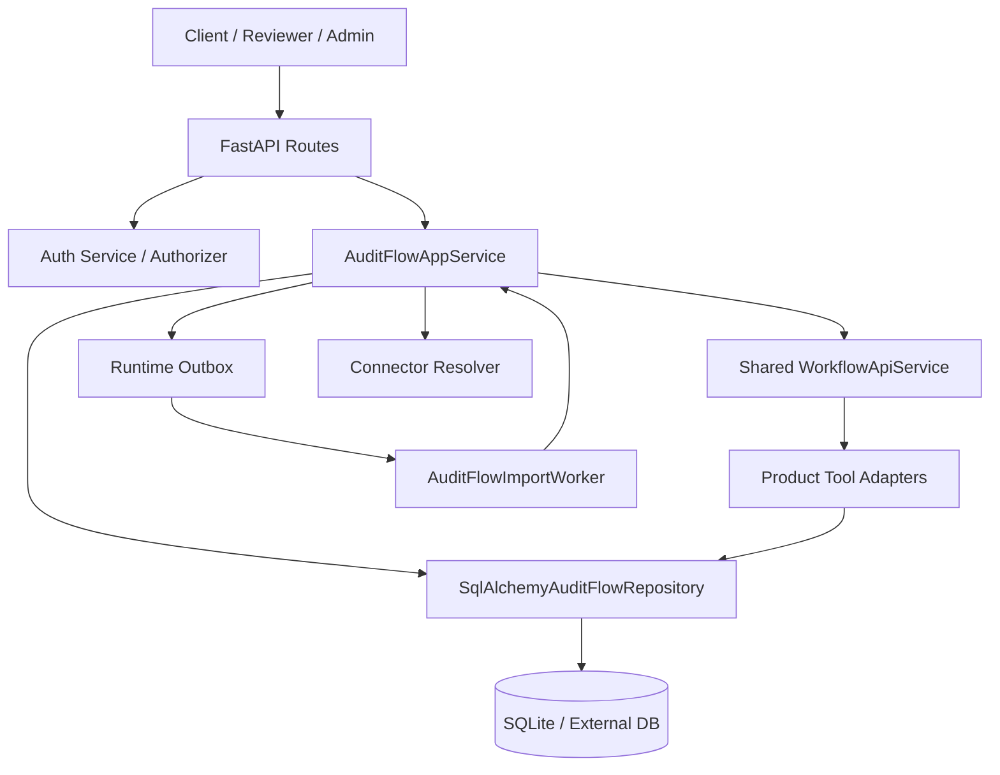

# AuditFlow 项目文档

## 1. 项目概览

AuditFlow 是一个面向审计取证闭环的后端产品仓库，目标是把分散在上传文件、Jira、Confluence 等来源中的证据统一纳入审计工作区，完成标准化、映射评审、缺口闭环和导出冻结。它解决的核心问题是审计证据分散、控制项映射依赖人工、评审版本容易漂移，以及导出材料缺少统一冻结与追溯能力。

核心功能列表：

- 审计工作区与审计周期管理。
- 本地上传证据导入与 Jira / Confluence 外部导入。
- 多格式工件标准化解析与证据切块。
- 证据词法检索、语义检索与混合召回。
- 控制项覆盖、映射评审、领取、分配、释放。
- 缺口记录、决策与评审历史追踪。
- 审计叙述材料生成与导出包冻结。
- 会话认证、幂等控制、SSE 事件流。
- 工具调用审计、记忆记录与运行时能力查询。
- Replay Harness 与向量检索基准验证。

项目当前状态：`开发中`

- 后端域模型、路由、仓储、测试和脚本已经较完整。
- 仍未看到正式的生产部署模板、迁移框架和前端工作台。

相关链接：

- Production：`> ⚠️ 待确认：仓库中未发现生产环境地址配置。`
- Staging：`> ⚠️ 待确认：仓库中未发现预发环境地址配置。`
- 设计稿：`> ⚠️ 待确认：仓库中未发现设计稿或设计系统链接。`

---

## 2. 技术栈

| 分类 | 技术 | 版本 | 选型原因 |
|------|------|------|-------------------------------|
| 后端语言 | Python | 3.12+ | `pyproject.toml` 明确要求 `>=3.12`，并且整个仓库围绕 Python 工具链组织 |
| 后端框架 | FastAPI | `>=0.110,<1.0` | 用于暴露 HTTP API、依赖注入、SSE 和认证路由 |
| 数据建模 | Pydantic | `>=2.11,<3.0` | 请求/响应模型、命令对象、Schema 生成统一基于 Pydantic v2 |
| ORM / 持久化 | SQLAlchemy | `>=2.0,<3.0` | 产品域表、共享运行时表、认证表都通过 SQLAlchemy 管理 |
| HTTP 客户端 | HTTPX | `>=0.27,<1.0` | 外部连接器走 HTTP 模式时使用 |
| AI 网关 | OpenAI Responses API（可选） | `openai>=2.24,<3.0` | 用于模型推理和 embedding，未配置时退回本地启发式实现 |
| 向量能力 | pgvector（可选） | `pgvector>=0.4,<1.0` | PostgreSQL 可用时支持原生向量索引，否则退回 ANN 元数据检索 |
| 数据库 | SQLite / PostgreSQL | 未固定 | 默认内存 SQLite；如传入外部 SQLAlchemy URL，可切换到持久化数据库 |
| 测试框架 | unittest | Python 标准库 | 所有测试均以 `python -m unittest discover` 组织 |
| CI 平台 | GitHub Actions | Actions v4/v5 | 通过 `.github/workflows/auditflow-ci.yml` 执行校验 |

---

## 3. 目录结构说明

```text
AuditFlow/
├── .github/
│   └── workflows/
│       └── auditflow-ci.yml        # GitHub Actions CI，安装依赖并运行统一校验脚本
├── docs/
│   └── PROJECT.md                  # 当前项目文档
├── replay_baselines/               # Replay Harness 生成或读取的基线数据
├── replay_reports/                 # Replay Harness 输出的评估报告
├── schemas/
│   └── connector_contracts/        # Jira / Confluence 连接器契约 JSON Schema
├── scripts/
│   ├── run_ci_checks.py            # CI 入口脚本
│   ├── run_demo_workflow.py        # 演示周期处理 + 导出流程
│   ├── run_import_worker.py        # 导入 worker 启动脚本
│   ├── run_api.py                  # 标准 API 启动脚本
│   ├── run_replay_harness.py       # Replay Harness 脚本
│   ├── run_runtime_smoke.py        # 本地 runtime / connector smoke
│   ├── run_vector_search_benchmark.py # 向量检索基准脚本
│   ├── generate_connector_schemas.py  # 连接器 Schema 生成脚本
│   ├── render_ci_workflow.py       # 重新渲染 CI 配置
│   └── vendor_shared_core.ps1      # 从 SharedAgentCore 同步共享内核
├── shared_core/
│   ├── agent_platform/             # 工作流、状态存储、共享认证、工具执行等共享能力
│   ├── docs/                       # 共享层的轻量文档
│   └── tests/                      # 共享层测试
├── src/
│   └── auditflow_app/
│       ├── app.py                  # FastAPI 工厂入口
│       ├── bootstrap.py            # 运行时装配、应用/worker/replay 构建
│       ├── routes.py               # API 路由、分页、SSE、错误映射
│       ├── service.py              # 核心业务编排
│       ├── repository.py           # SQLAlchemy 仓储与产品表定义
│       ├── worker.py               # 导入 worker 与 supervisor
│       ├── auth.py                 # 认证与授权包装
│       ├── connectors.py           # Jira / Confluence 连接器
│       ├── product_gateway.py      # 模型与 embedding 网关
│       ├── tool_adapters.py        # 产品工具适配层
│       ├── replay_harness.py       # 回放与对比评估
│       ├── vector_benchmark.py     # 向量检索模式基准
│       └── sample_payloads.py      # 演示命令与请求载荷
├── tests/
│   ├── fixtures/
│   │   └── connector_contracts/    # 连接器契约 fixture
│   ├── test_service.py             # 服务层主测试
│   ├── test_routes.py              # 路由和鉴权测试
│   ├── test_worker.py              # 导入 worker 测试
│   ├── test_connectors.py          # 连接器逻辑测试
│   ├── test_connector_contracts.py # HTTP 契约测试
│   ├── test_connector_schemas.py   # Schema 生成测试
│   ├── test_product_gateway.py     # 模型网关测试
│   ├── test_replay_harness.py      # 回放测试
│   └── test_vector_benchmark.py    # 向量基准测试
├── AGENT_CONTEXT.md                # 内部代理上下文，不属于业务文档
├── PROMPT_TOOL.md                  # 内部 Prompt/Tool 说明，不属于业务文档
├── pyproject.toml                  # Python 包配置和依赖
└── README.md                       # 仓库入口说明
```

补充说明：

- `.tmp/` 在运行测试和 replay 时会被频繁使用，但其中存在临时数据库目录，且当前环境下部分路径权限受限，不适合作为稳定文档对象。
- `shared_core/` 是事实上的共享平台内核，AuditFlow 通过 `vendor_shared_core.ps1` 从工作区的 `SharedAgentCore` 同步代码；运行时默认优先加载仓库内 vendored 版本，仅在 `AUDITFLOW_SHARED_CORE_SOURCE=workspace` 时切换到工作区副本。

---

## 4. 架构说明

### 4.1 整体架构

AuditFlow 采用“产品层 + 共享运行时”的分层架构，而不是单纯的 CRUD API：

- `routes.py` 负责请求接入、认证、错误映射、分页和 SSE。
- `service.py` 负责编排业务命令、幂等控制、事件发射和工作流调用。
- `repository.py` 负责产品域持久化、检索、快照和导出状态落库。
- `worker.py` 负责异步消费导入事件。
- `shared_core/agent_platform/` 提供工作流执行、状态存储、outbox、共享认证和工具执行基础设施。

这一设计的好处是：

- 产品层只实现审计业务差异，不重写工作流引擎。
- 导入、评审、导出都可以通过共享 outbox / workflow 基础设施串起来。
- 测试既能覆盖产品域规则，也能复用共享层测试能力。



### 4.2 核心数据流

典型链路：上传证据并推进周期处理

1. 客户端调用 `POST /api/v1/auditflow/cycles/{cycle_id}/imports/upload`。
2. 路由层校验认证、组织上下文和 `Idempotency-Key`。
3. `AuditFlowAppService.create_upload_import()` 先查幂等响应，再调用仓储创建导入记录。
4. 服务层向 outbox 追加 `auditflow.import.accepted` 和 `auditflow.import.requested` 事件。
5. `AuditFlowImportWorker` 轮询 outbox，过滤出 `auditflow.import.requested`。
6. Worker 调用 `process_import_event()`，解析上传内容或外部抓取内容。
7. 服务层将工件、证据、切块、embedding、semantic vector 写入仓储。
8. 服务层调用共享工作流 `auditflow_cycle_processing`，生成映射与挑战输出。
9. 仓储刷新控制项覆盖、评审队列和快照上下文。
10. 路由返回统一 envelope；订阅 `/api/v1/events/stream` 的客户端会收到事件更新。

---

## 5. 核心模块详解

### 5.1 应用装配模块

- **文件位置**：`src/auditflow_app/bootstrap.py`
- **职责**：装配工作流注册表、运行时 store、仓储、认证、工具适配器、模型网关、FastAPI 应用和导入 worker。
- **对外暴露的主要方法**：
  - `build_runtime_components()`：返回 registry、runtime_stores、repository、auth_service、execution_service 等运行时组件。
  - `build_fastapi_app()`：构建 FastAPI 应用。
  - `build_app_service()`：构建 `AuditFlowAppService`。
  - `build_import_worker()`：构建导入 worker。
  - `build_replay_harness()`：构建 Replay Harness。
- **依赖**：`shared_core.agent_platform`、`SqlAlchemyAuditFlowRepository`、`SqlAlchemyAuditFlowAuthService`、`AuditFlowProductModelGateway`。
- **注意事项**：
  - 默认数据库 URL 为 `sqlite+pysqlite:///:memory:`。
  - 内存 SQLite 会自动启用 `StaticPool`，意味着默认更适合测试和演示。

### 5.2 路由模块

- **文件位置**：`src/auditflow_app/routes.py`
- **职责**：定义全部 HTTP 路由、SSE 事件流、分页、统一响应 envelope、错误码映射和角色校验。
- **对外暴露的主要方法**：
  - `create_fastapi_app(service, authorizer=None)`：注册所有路由。
  - `success_envelope(data, ...)`：统一包装响应。
  - `map_domain_error(exc, path="")`：把领域异常映射到 HTTP 错误码。
  - `paginate_collection(items, cursor, limit)`：统一游标分页。
- **依赖**：`AuditFlowAppService`、`AuditFlowAuthorizer`、FastAPI。
- **注意事项**：
  - 成功响应结构实际为 `{ "data": ..., "meta": ... }`，不是常见的 `code/message/data` 三段式。
  - 角色分为 `viewer`、`reviewer`、`product_admin`，并支持 `org_admin -> product_admin` 别名。

### 5.3 服务编排模块

- **文件位置**：`src/auditflow_app/service.py`
- **职责**：编排审计业务命令、工作流执行、幂等存储、导入标准化、事件发射和导出冻结。
- **对外暴露的主要方法**：
  - `create_workspace()` / `create_cycle()`：创建工作区和周期。
  - `create_upload_import()` / `create_external_import()`：接受导入请求。
  - `dispatch_import_jobs()`：触发导入 worker 处理。
  - `review_mapping()` / `claim_mapping()` / `assign_mapping()`：处理映射评审与协作。
  - `decide_gap()`：处理缺口决策。
  - `process_cycle()`：触发 `auditflow_cycle_processing`。
  - `create_export_package()` / `generate_export()`：导出包创建与导出工作流执行。
  - `get_runtime_capabilities()`：查询模型、embedding、向量和连接器能力。
- **依赖**：`AuditFlowRepository`、共享 `WorkflowApiService`、runtime outbox、连接器解析器。
- **注意事项**：
  - 幂等控制贯穿导入、评审、导出。
  - 上传导入支持文本与二进制内容并行输入。
  - 多种二进制格式会退化为“可提取文本”或“人工跟进提示”。

### 5.4 仓储模块

- **文件位置**：`src/auditflow_app/repository.py`
- **职责**：定义产品域表模型，持久化工作区、周期、证据、映射、缺口、快照、导出和向量索引。
- **对外暴露的主要方法**：
  - `create_workspace()` / `create_cycle()`：创建主数据。
  - `create_upload_import()` / `create_external_import()`：落库导入源。
  - `search_evidence()`：执行证据检索。
  - `list_memory_records()`：查询长期/短期记忆记录。
  - `list_review_queue()`：查询评审队列。
  - `claim_mapping()` / `assign_mapping()` / `release_mapping_claim()` / `release_mapping_assignment()`：处理协作状态。
  - `decide_gap()`：更新缺口状态。
  - `record_export_result()` / `list_export_packages()` / `get_export_package()`：导出冻结持久化。
- **依赖**：SQLAlchemy、共享 runtime stores。
- **注意事项**：
  - 既支持词法索引，也支持语义向量；pgvector 不可用时会自动退回 ANN 元数据实现。
  - 周期快照与导出包存在显式去重与不可变约束。

### 5.5 导入 Worker 模块

- **文件位置**：`src/auditflow_app/worker.py`
- **职责**：轮询 outbox 中的导入事件，并调用具体导入处理器完成标准化流程。
- **对外暴露的主要方法**：
  - `AuditFlowImportWorker.register_handler()`：注册上传、Jira、Confluence 等处理器。
  - `AuditFlowImportWorker.run()`：执行轮询处理。
  - `AuditFlowImportWorker._handle_event()`：按事件类型分发。
- **依赖**：`AuditFlowAppService`、`EnvConfiguredConnectorResolver`、共享 outbox store。
- **注意事项**：
  - Worker 只消费 `auditflow.import.requested`。
  - supervisor 会处理轮询、退避、心跳和守护策略。

### 5.6 连接器、模型网关与工具适配模块

- **文件位置**：
  - `src/auditflow_app/connectors.py`
  - `src/auditflow_app/product_gateway.py`
  - `src/auditflow_app/tool_adapters.py`
  - `src/auditflow_app/replay_harness.py`
- **职责**：
  - 连接器负责 Jira / Confluence 抓取与能力探测。
  - 模型网关负责本地启发式输出与 OpenAI Responses 路径切换。
  - 工具适配器把证据库、向量库、控制目录、快照校验等能力注册到工作流。
  - Replay Harness 负责工作流结果回放和对比评估。
- **对外暴露的主要方法**：
  - `EnvConfiguredConnectorResolver.describe_capability()`
  - `AuditFlowProductModelGateway.generate()`
  - `register_auditflow_product_tool_adapters()`
  - `AuditFlowReplayHarness.*`
- **依赖**：共享 runtime catalog、OpenAI SDK（可选）、HTTPX（可选）。
- **注意事项**：
  - 多数远程能力都支持 `auto -> local/http` 选择。
  - 文档中凡涉及 OpenAI 的行为，均以环境变量是否配置为前提。

---

## 6. API 文档

### 6.1 通用约定

- Base URL：`https://<host>/api/v1`
  - 仓库未显式给出部署域名，当前可确定的 API 路径前缀为 `/api/v1`。
- 认证方式：
  - 会话模式：Bearer Token。
  - 回退模式：请求头携带组织、用户、角色信息。
- 请求格式：`Content-Type: application/json`
- 成功响应结构：

```json
{
  "data": {},
  "meta": {
    "request_id": "optional",
    "has_more": false,
    "next_cursor": "optional",
    "workflow_run_id": "optional"
  }
}
```

- 分页方式：游标分页，`cursor` 基于 `offset:<number>` 的 Base64 URL-safe 编码。
- 统一请求头：
  - `Authorization: Bearer <token>`（会话模式）
  - `Idempotency-Key: <key>`（写接口常用）
  - `X-Request-Id: <request-id>`（可选）
  - `X-Organization-Id` / `X-User-Id` / `X-User-Role`（Header 回退模式）

常见错误码：

| 错误码 | 含义 |
|--------|------|
| `AUTH_REQUIRED` | 未提供认证信息 |
| `AUTH_FORBIDDEN` | 角色权限不足 |
| `TENANT_CONTEXT_REQUIRED` | 缺少组织上下文 |
| `AUTH_INVALID_CREDENTIALS` | 登录凭据错误 |
| `AUTH_SESSION_REVOKED` | 会话已失效 |
| `AUDIT_WORKSPACE_NOT_FOUND` | 工作区不存在 |
| `AUDIT_CYCLE_NOT_FOUND` | 审计周期不存在 |
| `CONTROL_STATE_NOT_FOUND` | 控制项状态不存在 |
| `EVIDENCE_NOT_FOUND` | 证据不存在 |
| `EXPORT_PACKAGE_NOT_FOUND` | 导出包不存在 |
| `IDEMPOTENCY_CONFLICT` | 同幂等键请求体不一致 |
| `INVALID_CURSOR` | 分页游标非法 |
| `INVALID_ARTIFACT_BYTES` | 上传内容非法 |
| `INVALID_SEARCH_QUERY` | 检索条件非法 |
| `MAPPING_REVIEW_CONFLICT` | 映射评审基于旧快照写入 |
| `CYCLE_NOT_READY_FOR_EXPORT` | 周期尚未满足导出条件 |

### 6.2 接口列表

#### 6.2.1 认证与运行时接口

| 方法 | 路径 | 说明 | 请求体 / 关键参数 | 关键响应 | 权限 |
|------|------|------|------------------|----------|------|
| `POST` | `/auth/session` | 创建会话 | `SessionCreateCommand` | `SessionResponse` | 无 |
| `POST` | `/auth/session/refresh` | 刷新会话 | `refresh_token` Cookie / Header | `SessionResponse` | 无 |
| `DELETE` | `/auth/session/current` | 注销当前会话 | Bearer Token | 空响应 | `viewer` |
| `GET` | `/me` | 获取当前用户信息 | 无 | `CurrentUserResponse` | `viewer` |
| `GET` | `/health` | 健康检查 | 无 | `HealthResponse` | 无 |
| `GET` | `/auditflow/runtime-capabilities` | 查询模型、embedding、向量、连接器能力 | 无 | `RuntimeCapabilitiesResponse` | `product_admin` |
| `GET` | `/workflows` | 列出工作流执行 | 无 | 共享工作流列表 | `viewer` |
| `GET` | `/workflows/{workflow_run_id}` | 查询单个工作流状态 | `workflow_run_id` | `AuditFlowWorkflowStateResponse` | `viewer` |
| `GET` | `/events/stream` | SSE 事件订阅 | `topic`、`resume_after_id` | `text/event-stream` | `viewer` |

#### 6.2.2 工作区与周期接口

| 方法 | 路径 | 说明 | 请求体 / 关键参数 | 关键响应 | 权限 |
|------|------|------|------------------|----------|------|
| `POST` | `/auditflow/workspaces` | 创建工作区 | `CreateWorkspaceCommand` | `AuditWorkspaceSummary` | `product_admin` |
| `GET` | `/auditflow/workspaces/{workspace_id}` | 查询工作区 | `workspace_id` | `AuditWorkspaceSummary` | `viewer` |
| `POST` | `/auditflow/cycles` | 创建审计周期 | `CreateCycleCommand` | `AuditCycleSummary` | `product_admin` |
| `GET` | `/auditflow/cycles` | 列出周期 | `workspace_id` 等查询参数 | 周期列表 | `viewer` |
| `GET` | `/auditflow/cycles/{cycle_id}/dashboard` | 查询周期 dashboard | `cycle_id` | `AuditCycleDashboardResponse` | `viewer` |
| `GET` | `/auditflow/cycles/{cycle_id}/controls` | 列出周期控制项 | `cursor`、`limit` | `ControlCoverageSummary[]` | `viewer` |
| `GET` | `/auditflow/cycles/{cycle_id}/mappings` | 列出映射 | `cursor`、`limit` | `MappingSummary[]` | `viewer` |
| `GET` | `/auditflow/cycles/{cycle_id}/controls/{control_state_id}` | 查询控制项详情 | `control_state_id` | `ControlDetailResponse` | `viewer` |
| `GET` | `/auditflow/cycles/{cycle_id}/controls/{control_state_id}/tool-access-audit` | 查询控制项工具审计 | `cursor`、`limit` | `ToolAccessAuditSummary[]` | `viewer` |
| `POST` | `/auditflow/cycles/process` | 触发周期处理工作流 | `CycleProcessingCommand` | `AuditFlowRunResponse` | `product_admin` |

示例：创建工作区

```json
{
  "workspace_name": "AuditFlow Demo Workspace",
  "slug": "auditflow-demo",
  "framework_name": "SOC2",
  "workspace_status": "active",
  "default_owner_user_id": "user-admin-1",
  "settings": {
    "freshness_days_default": 90
  }
}
```

#### 6.2.3 证据、评审与记忆接口

| 方法 | 路径 | 说明 | 请求体 / 关键参数 | 关键响应 | 权限 |
|------|------|------|------------------|----------|------|
| `GET` | `/auditflow/evidence/{evidence_id}` | 查询证据详情 | `evidence_id` | `EvidenceDetail` | `viewer` |
| `GET` | `/auditflow/cycles/{cycle_id}/evidence-search` | 证据检索 | `query`、`limit` | `EvidenceSearchResponse` | `viewer` |
| `GET` | `/auditflow/cycles/{cycle_id}/memory-records` | 查询记忆记录 | `memory_type`、`limit` | `MemoryRecordListResponse` | `viewer` |
| `GET` | `/auditflow/cycles/{cycle_id}/gaps` | 列出缺口 | `status`、`limit` | `GapSummary[]` | `reviewer` |
| `GET` | `/auditflow/cycles/{cycle_id}/review-queue` | 列出周期评审队列 | 排序、优先级、claim/assignment 过滤 | `ReviewQueueResponse` | `reviewer` |
| `GET` | `/auditflow/review-queue` | 全局评审队列 | 同上 | `ReviewQueueResponse` | `reviewer` |
| `GET` | `/auditflow/cycles/{cycle_id}/review-decisions` | 列出评审历史 | `limit` | `ReviewDecisionListResponse` | `reviewer` |
| `GET` | `/auditflow/cycles/{cycle_id}/tool-access-audit` | 周期工具调用审计 | `limit` | `ToolAccessAuditListResponse` | `reviewer` |
| `GET` | `/auditflow/tool-access-audit` | 全局工具调用审计 | `limit` | `ToolAccessAuditListResponse` | `reviewer` |
| `GET` | `/auditflow/mappings/{mapping_id}/tool-access-audit` | 单映射工具审计 | `mapping_id` | `ToolAccessAuditListResponse` | `reviewer` |
| `POST` | `/auditflow/mappings/{mapping_id}/review` | 提交映射评审 | `MappingReviewCommand` | `MappingReviewResponse` | `reviewer` |
| `POST` | `/auditflow/mappings/{mapping_id}/claim` | 领取映射 | `MappingClaimCommand` | `MappingClaimResponse` | `reviewer` |
| `POST` | `/auditflow/mappings/{mapping_id}/assign` | 分配映射 | `MappingAssignCommand` | `MappingAssignmentResponse` | `product_admin` |
| `POST` | `/auditflow/mappings/{mapping_id}/claim/release` | 释放领取 | `MappingClaimReleaseCommand` | `MappingClaimResponse` | `reviewer` |
| `POST` | `/auditflow/mappings/{mapping_id}/assign/release` | 释放分配 | `MappingAssignReleaseCommand` | `MappingAssignmentResponse` | `reviewer` |
| `POST` | `/auditflow/gaps/{gap_id}/decision` | 提交缺口决策 | `GapDecisionCommand` | `ReviewDecisionSummary` | `reviewer` |
| `GET` | `/auditflow/cycles/{cycle_id}/narratives` | 列出叙述材料 | `snapshot_version` | `NarrativeSummary[]` | `viewer` |

示例：提交映射评审

```json
{
  "decision": "accept",
  "comment": "Citation is sufficient.",
  "target_control_id": null,
  "expected_snapshot_version": 3
}
```

#### 6.2.4 导入与导出接口

| 方法 | 路径 | 说明 | 请求体 / 关键参数 | 关键响应 | 权限 |
|------|------|------|------------------|----------|------|
| `GET` | `/auditflow/cycles/{cycle_id}/imports` | 列出导入任务 | `status`、`source_type`、`cursor` | `ImportListResponse` | `viewer` |
| `POST` | `/auditflow/cycles/{cycle_id}/imports/upload` | 创建上传导入 | `UploadImportCommand` + `Idempotency-Key` | `ImportAcceptedResponse` | `reviewer` |
| `POST` | `/auditflow/cycles/{cycle_id}/imports/external` | 创建外部导入 | `ExternalImportCommand` + `Idempotency-Key` | `ImportAcceptedResponse` | `reviewer` |
| `POST` | `/auditflow/import-jobs/dispatch` | 主动调度导入任务 | 无 | `ImportDispatchResponse` | `product_admin` |
| `GET` | `/auditflow/cycles/{cycle_id}/exports` | 列出导出包 | `snapshot_version`、`cursor` | `ExportPackageSummary[]` | `viewer` |
| `POST` | `/auditflow/cycles/{cycle_id}/exports` | 创建导出包并冻结 | `ExportCreateCommand` + `Idempotency-Key` | `ExportPackageSummary` | `reviewer` |
| `POST` | `/auditflow/exports/generate` | 直接执行导出工作流 | `ExportGenerationCommand` | `AuditFlowRunResponse` | `product_admin` |
| `GET` | `/auditflow/exports/{package_id}` | 查询导出包详情 | `package_id` | `ExportPackageSummary` | `viewer` |

示例：上传导入

```json
{
  "workflow_run_id": "auditflow-upload-001",
  "artifact_id": "artifact-upload-1",
  "display_name": "Quarterly Access Review Export",
  "captured_at": "2026-03-16T09:00:00Z",
  "evidence_type_hint": "report",
  "source_locator": "uploads/q1-access-review.csv",
  "artifact_text": "Quarterly Access Review Export\n\nControl owner: Security Engineering",
  "artifact_bytes_base64": null,
  "organization_id": "org-1",
  "workspace_id": "audit-ws-1"
}
```

示例：外部导入

```json
{
  "workflow_run_id": "auditflow-jira-001",
  "connection_id": "connection-jira-1",
  "provider": "jira",
  "upstream_ids": ["SEC-125", "SEC-126"],
  "query": null,
  "organization_id": "org-1",
  "workspace_id": "audit-ws-1"
}
```

---

## 7. 数据库与数据模型

### 7.1 数据库概览

- 数据库类型：
  - 默认：内存 SQLite，连接串为 `sqlite+pysqlite:///:memory:`
  - 可选：任意 SQLAlchemy 支持的外部数据库；向量原生索引场景偏向 PostgreSQL + pgvector
- 连接方式：
  - 由 `bootstrap._create_runtime_engine()` 统一创建 engine
  - SQLite 会启用 `check_same_thread=False`
  - 内存 SQLite 会启用 `StaticPool`
- ORM：SQLAlchemy 2
- 共享运行时表：
  - 通过 `shared_core.agent_platform.create_sqlalchemy_runtime_stores()` 创建
  - 包括工作流状态、checkpoint、replay store、outbox、共享认证等

### 7.2 核心数据模型

#### 表概览

| 表名 | 作用 |
|------|------|
| `auditflow_workspace` | 审计工作区 |
| `auditflow_cycle` | 审计周期 |
| `auditflow_control_catalog` | 控制项目录 |
| `auditflow_control_coverage` | 周期内控制项覆盖 |
| `auditflow_evidence_source` | 导入源 |
| `auditflow_mapping` | 控制项与证据映射 |
| `auditflow_gap` | 缺口记录 |
| `auditflow_review_decision` | 评审历史 |
| `auditflow_tool_access_audit` | 工具调用审计 |
| `auditflow_artifact_blob` | 原始或标准化工件文本 |
| `auditflow_idempotency_key` | 幂等响应缓存 |
| `auditflow_evidence` | 证据主表 |
| `auditflow_evidence_chunk` | 证据切块 |
| `auditflow_memory_record` | 记忆记录 |
| `auditflow_embedding_chunk` | embedding 文本切片 |
| `auditflow_semantic_vector` | 语义向量及 ANN 元数据 |
| `auditflow_narrative` | 叙述材料 |
| `auditflow_cycle_snapshot` | 周期快照 |
| `auditflow_export_package` | 导出包 |

#### 核心表字段说明

**表名：`auditflow_workspace`**

| 字段名 | 类型 | 约束 | 说明 |
|--------|------|------|------|
| `workspace_id` | `String(255)` | PK, NOT NULL | 工作区主键 |
| `organization_id` | `String(255)` | INDEX, NOT NULL | 租户隔离字段 |
| `workspace_name` | `String(255)` | NOT NULL | 工作区名称 |
| `slug` | `String(255)` | INDEX, NOT NULL | 工作区短标识 |
| `framework_name` | `String(50)` | NOT NULL | 审计框架，如 `SOC2` |
| `workspace_status` | `String(50)` | NOT NULL | 工作区状态 |
| `default_owner_user_id` | `String(255)` | NULLABLE | 默认负责人 |
| `settings_payload` | `JSON` | NOT NULL | 工作区配置 |

**关系说明**：`auditflow_workspace` -> `auditflow_cycle` 为一对多。

**表名：`auditflow_cycle`**

| 字段名 | 类型 | 约束 | 说明 |
|--------|------|------|------|
| `cycle_id` | `String(255)` | PK | 周期主键 |
| `workspace_id` | `String(255)` | INDEX | 所属工作区 |
| `cycle_name` | `String(255)` | NOT NULL | 周期名称 |
| `cycle_status` | `String(50)` | NOT NULL | 周期状态 |
| `audit_period_start` | `Date` | NULLABLE | 审计起始日 |
| `audit_period_end` | `Date` | NULLABLE | 审计结束日 |
| `current_snapshot_version` | `Integer` | DEFAULT 0 | 当前快照版本 |
| `coverage_status` | `String(50)` | NOT NULL | 覆盖状态 |
| `review_queue_count` | `Integer` | DEFAULT 0 | 待评审数量 |
| `open_gap_count` | `Integer` | DEFAULT 0 | 未关闭缺口数量 |

**关系说明**：`auditflow_cycle` -> `auditflow_mapping` / `auditflow_gap` / `auditflow_export_package` 均为一对多。

**表名：`auditflow_mapping`**

| 字段名 | 类型 | 约束 | 说明 |
|--------|------|------|------|
| `mapping_id` | `String(255)` | PK | 映射主键 |
| `cycle_id` | `String(255)` | INDEX | 所属周期 |
| `control_state_id` | `String(255)` | INDEX | 控制项状态 ID |
| `mapping_status` | `String(50)` | NOT NULL | 映射状态 |
| `snapshot_version` | `Integer` | DEFAULT 1 | 所属快照版本 |
| `evidence_item_id` | `String(255)` | NOT NULL | 证据 ID |
| `rationale_summary` | `Text` | NOT NULL | 映射理由 |
| `citation_refs` | `JSON` | NOT NULL | 证据引用 |
| `reviewer_claimed_by_user_id` | `String(255)` | NULLABLE | 当前领取人 |
| `reviewer_assigned_user_id` | `String(255)` | NULLABLE | 当前分配人 |

**关系说明**：`auditflow_mapping` 与 `auditflow_review_decision` 为一对多。

**表名：`auditflow_gap`**

| 字段名 | 类型 | 约束 | 说明 |
|--------|------|------|------|
| `gap_id` | `String(255)` | PK | 缺口主键 |
| `control_state_id` | `String(255)` | INDEX | 控制项状态 ID |
| `gap_type` | `String(100)` | NOT NULL | 缺口类型 |
| `severity` | `String(50)` | NOT NULL | 严重级别 |
| `status` | `String(50)` | NOT NULL | 当前状态 |
| `snapshot_version` | `Integer` | DEFAULT 1 | 缺口对应快照版本 |
| `recommended_action` | `Text` | NOT NULL | 建议动作 |
| `resolved_at` | `DateTime` | NULLABLE | 解决时间 |

**关系说明**：`auditflow_gap` 与 `auditflow_review_decision` 为一对多。

**表名：`auditflow_evidence`**

| 字段名 | 类型 | 约束 | 说明 |
|--------|------|------|------|
| `evidence_id` | `String(255)` | PK | 证据主键 |
| `audit_cycle_id` | `String(255)` | INDEX | 所属周期 |
| `source_artifact_id` | `String(255)` | NULLABLE | 原始工件 ID |
| `normalized_artifact_id` | `String(255)` | NULLABLE | 标准化工件 ID |
| `title` | `String(255)` | NOT NULL | 证据标题 |
| `evidence_type` | `String(50)` | NOT NULL | 证据类型 |
| `parse_status` | `String(50)` | NOT NULL | 解析状态 |
| `captured_at` | `DateTime` | NOT NULL | 捕获时间 |
| `summary` | `Text` | NOT NULL | 证据摘要 |
| `source_payload` | `JSON` | NOT NULL | 来源元数据 |

**关系说明**：`auditflow_evidence` -> `auditflow_evidence_chunk` 为一对多。

**表名：`auditflow_semantic_vector`**

| 字段名 | 类型 | 约束 | 说明 |
|--------|------|------|------|
| `semantic_vector_id` | `String(255)` | PK | 向量主键 |
| `cycle_id` | `String(255)` | INDEX | 所属周期 |
| `subject_type` | `String(80)` | INDEX | 关联对象类型 |
| `subject_id` | `String(255)` | INDEX | 关联对象 ID |
| `chunk_id` | `String(255)` | INDEX | 关联 chunk |
| `ann_bucket_keys` | `JSON` | NOT NULL | ANN 桶键 |
| `semantic_terms` | `JSON` | NOT NULL | 词项补充 |
| `embedding_dimension` | `Integer` | NOT NULL | 向量维度 |
| `embedding_vector` | `NativeVectorType` | NULLABLE | pgvector 向量 |
| `model_name` | `String(120)` | NOT NULL | embedding 模型名 |

**关系说明**：向量表与 `auditflow_embedding_chunk`、`auditflow_evidence_chunk` 共同支撑检索。

**表名：`auditflow_export_package`**

| 字段名 | 类型 | 约束 | 说明 |
|--------|------|------|------|
| `package_id` | `String(255)` | PK | 导出包主键 |
| `cycle_id` | `String(255)` | INDEX | 所属周期 |
| `snapshot_version` | `Integer` | NOT NULL | 冻结快照版本 |
| `status` | `String(50)` | NOT NULL | 导出状态 |
| `artifact_id` | `String(255)` | NULLABLE | 导出工件 ID |
| `manifest_artifact_id` | `String(255)` | NULLABLE | manifest 工件 ID |
| `workflow_run_id` | `String(255)` | NULLABLE | 工作流运行 ID |
| `immutable_at` | `DateTime` | NULLABLE | 冻结时间 |

**关系说明**：导出包与 `auditflow_cycle_snapshot` 通过 `cycle_id + snapshot_version` 建立冻结语义。

### 7.3 迁移说明

- 迁移工具：`未发现 Alembic / Django migration / 自定义 migrations 目录`
- 当前建表方式：
  - 共享层运行时表通过 `create_sqlalchemy_runtime_stores()` 初始化
  - AuditFlow 产品表通过 `create_auditflow_tables(engine)` 初始化
- 迁移文件位置：`> ⚠️ 待确认：当前仓库未提供独立迁移目录。`

---

## 8. 环境搭建与本地运行

### 8.1 前置依赖

- Python `>= 3.12`
- `pip`
- 可选：
  - FastAPI / Uvicorn（若要启动 API）
  - HTTPX（若要启用 HTTP 连接器）
  - OpenAI SDK（若要启用远程模型或 embedding）
  - PostgreSQL + pgvector（若要验证原生向量索引）

### 8.2 初始化步骤

```powershell
# 1. 进入项目
cd D:\project\AuditFlow

# 2. 安装依赖
python -m pip install --upgrade pip
python -m pip install -e .[api,connectors]
python -m pip install -e .[api,connectors,ai]  # 如需 OpenAI 路径

# 3. 准备本地环境
Copy-Item .env.example .env

# 4. 运行测试
python -m unittest discover -s tests -t .

# 5. 生成连接器 Schema（可选）
python .\scripts\generate_connector_schemas.py

# 6. 运行演示流程
python .\scripts\run_demo_workflow.py

# 7. 启动导入 worker（可选）
python .\scripts\run_import_worker.py --poll --iterations 2 --max-idle-polls 1 --seed-upload

# 8. 运行回放与本地 smoke（可选）
python .\scripts\run_replay_harness.py
python .\scripts\run_runtime_smoke.py
python .\scripts\run_vector_search_benchmark.py --mode ann

# 9. 启动 API
python .\scripts\run_api.py --host 127.0.0.1 --port 8000
```

本地脚本默认使用仓库内 `.local/auditflow.db` 持久化数据库；如需覆盖，可以设置 `AUDITFLOW_DATABASE_URL` 或给脚本显式传入 `--database-url`。

运行时默认优先加载仓库内 `shared_core`；只有在 `AUDITFLOW_SHARED_CORE_SOURCE=workspace` 时才会切换到工作区 sibling `SharedAgentCore`。

---

## 9. 配置项说明

仓库根目录提供了 `.env.example`；以下配置项为本地运行最常用的环境变量。

### 9.1 认证与会话

| 变量名 | 必填 | 默认值 | 说明 |
|--------|------|--------|------|
| `AUDITFLOW_AUTH_SECRET` | 否 | `auditflow-dev-secret` | 会话 token 签名密钥，仅适合开发环境 |

### 9.2 模型与 OpenAI

| 变量名 | 必填 | 默认值 | 说明 |
|--------|------|--------|------|
| `AUDITFLOW_MODEL_PROVIDER` | 否 | `auto` | 模型推理路径，`auto/local/openai` |
| `AUDITFLOW_OPENAI_MODEL` | 否 | 空 | OpenAI Responses 模型名 |
| `AUDITFLOW_OPENAI_BASE_URL` | 否 | SDK 默认 | OpenAI base URL |
| `AUDITFLOW_OPENAI_TIMEOUT_SECONDS` | 否 | `30`（模型）/ `20`（embedding） | OpenAI 请求超时 |
| `OPENAI_API_KEY` | 否 | 空 | OpenAI 访问密钥 |

### 9.3 Embedding 与向量检索

| 变量名 | 必填 | 默认值 | 说明 |
|--------|------|--------|------|
| `AUDITFLOW_EMBEDDING_PROVIDER` | 否 | `auto` | embedding 路径，`auto/local/openai` |
| `AUDITFLOW_OPENAI_EMBEDDING_MODEL` | 否 | 空 | OpenAI embedding 模型名 |
| `AUDITFLOW_OPENAI_EMBEDDING_DIMENSIONS` | 否 | `96` | embedding 向量维度 |
| `AUDITFLOW_VECTOR_SEARCH_MODE` | 否 | `auto` | `auto/ann/flat/pgvector` |
| `AUDITFLOW_VECTOR_CANDIDATE_LIMIT` | 否 | 代码默认 | 语义检索候选数 |
| `AUDITFLOW_VECTOR_ANN_BUCKETS` | 否 | 代码默认 | ANN bucket 数 |

### 9.4 Jira 连接器

| 变量名 | 必填 | 默认值 | 说明 |
|--------|------|--------|------|
| `AUDITFLOW_JIRA_FETCH_MODE` | 否 | `auto` | `auto/local/http` |
| `AUDITFLOW_JIRA_URL_TEMPLATE` | 否 | 空 | 按 selector 拉取 issue 的 URL 模板 |
| `AUDITFLOW_JIRA_QUERY_URL_TEMPLATE` | 否 | 空 | 按 query 拉取结果的 URL 模板 |
| `AUDITFLOW_JIRA_TIMEOUT_SECONDS` | 否 | `20` | HTTP 超时秒数 |
| `AUDITFLOW_JIRA_HEADERS_JSON` | 否 | 空 | 附加请求头 JSON |
| `AUDITFLOW_JIRA_AUTH_TYPE` | 否 | `bearer` | `bearer/basic` |
| `AUDITFLOW_JIRA_AUTH_TOKEN` | 否 | 空 | Bearer token |
| `AUDITFLOW_JIRA_USERNAME` | 否 | 空 | Basic auth 用户名 |
| `AUDITFLOW_JIRA_PASSWORD` | 否 | 空 | Basic auth 密码 |

### 9.5 Confluence 连接器

| 变量名 | 必填 | 默认值 | 说明 |
|--------|------|--------|------|
| `AUDITFLOW_CONFLUENCE_FETCH_MODE` | 否 | `auto` | `auto/local/http` |
| `AUDITFLOW_CONFLUENCE_URL_TEMPLATE` | 否 | 空 | 按 selector 拉取 page 的 URL 模板 |
| `AUDITFLOW_CONFLUENCE_QUERY_URL_TEMPLATE` | 否 | 空 | 按 query 拉取结果的 URL 模板 |
| `AUDITFLOW_CONFLUENCE_TIMEOUT_SECONDS` | 否 | `20` | HTTP 超时秒数 |
| `AUDITFLOW_CONFLUENCE_HEADERS_JSON` | 否 | 空 | 附加请求头 JSON |
| `AUDITFLOW_CONFLUENCE_AUTH_TYPE` | 否 | `bearer` | `bearer/basic` |
| `AUDITFLOW_CONFLUENCE_AUTH_TOKEN` | 否 | 空 | Bearer token |
| `AUDITFLOW_CONFLUENCE_USERNAME` | 否 | 空 | Basic auth 用户名 |
| `AUDITFLOW_CONFLUENCE_PASSWORD` | 否 | 空 | Basic auth 密码 |

---

## 10. 部署说明

### 10.1 构建

当前仓库是 Python 包结构，没有独立前端构建产物。

```powershell
python -m pip install -e .[api,connectors]
```

### 10.2 生产环境启动

仓库提供了标准 API 启动脚本：

```powershell
python .\scripts\run_api.py --host 0.0.0.0 --port 8000
```

如需覆盖数据库，可附加 `--database-url sqlite+pysqlite:///./.local/auditflow.db`，或者通过 `AUDITFLOW_DATABASE_URL` 提前注入。

### 10.3 Docker 部署

> ⚠️ 待确认：未发现 `Dockerfile` 或 `docker-compose.yml`，当前仓库没有完整容器部署脚本。

### 10.4 CI/CD 说明

CI 文件：`[auditflow-ci.yml](/D:/project/AuditFlow/.github/workflows/auditflow-ci.yml)`

- 触发条件：
  - `push`
  - `pull_request`
  - `workflow_dispatch`
- 路径过滤：
  - `.github/workflows/auditflow-ci.yml`
  - `pyproject.toml`
  - `scripts/**`
  - `schemas/**`
  - `src/**`
  - `shared_core/**`
  - `tests/**`
  - `README.md`
  - `PROMPT_TOOL.md`
- 流水线阶段：
  1. Checkout
  2. Setup Python 3.12
  3. `pip install -e .[api,connectors]`
  4. `python scripts/run_ci_checks.py`
- `run_ci_checks.py` 实际执行：
  1. 检查 GitHub Actions workflow 是否与生成模板一致
  2. 运行 `unittest`
  3. 运行 `scripts/generate_connector_schemas.py`
  4. 使用 `git diff --exit-code -- schemas/connector_contracts`
  5. 运行 smoke 脚本：
     - `scripts/run_demo_workflow.py`
     - `scripts/run_import_worker.py --poll --iterations 2 --max-idle-polls 1 --seed-upload`
     - `scripts/run_replay_harness.py`
     - `scripts/run_runtime_smoke.py`

---

## 11. 测试说明

### 11.1 测试框架

- 单元测试：`unittest`
- 集成测试：仍然通过 `unittest` 组织，但覆盖了路由、连接器契约、worker 和 replay 场景
- E2E 测试：`未发现 Playwright / Cypress 等浏览器端 E2E`

### 11.2 运行测试

```powershell
# 全量测试
python -m unittest discover -s tests -t .

# 连接器 Schema 生成校验
python .\scripts\generate_connector_schemas.py

# CI 等价校验
python .\scripts\run_ci_checks.py

# 回放校验
python .\scripts\run_replay_harness.py
```

### 11.3 测试结构说明

- `tests/test_service.py`
  - 服务层主流程测试，覆盖工作区、周期、导入、评审、导出和异常情况
- `tests/test_routes.py`
  - 路由错误映射、分页、SSE、鉴权和 envelope 测试
- `tests/test_worker.py`
  - 导入 worker 与 supervisor 行为测试
- `tests/test_connectors.py`
  - 本地 / HTTP 连接器解析测试
- `tests/test_connector_contracts.py`
  - 连接器远程请求/响应 fixture 合同测试
- `tests/test_connector_schemas.py`
  - JSON Schema 生成测试
- `tests/test_product_gateway.py`
  - 模型 provider、OpenAI fallback 和向量模式测试
- `tests/test_replay_harness.py`
  - 回放基线和报告评估测试
- `tests/fixtures/connector_contracts/`
  - Jira / Confluence fixture 数据

---

## 12. 注意事项 & 已知问题

- 未发现显式 `TODO` / `FIXME` / `HACK` 注释。
- 当前仓库未提供正式迁移框架；数据库结构主要依赖启动时建表逻辑，不适合直接作为生产迁移策略。
- 本地脚本默认使用 `.local/auditflow.db` 做持久化；如果直接在库级 API 上不传 `database_url`，仍会退回内存 SQLite。
- 向量检索模式存在多级退回链路：`pgvector -> ann -> flat`，实际生效模式必须通过 runtime capability 检查。
- 外部连接器在 `auto` 模式下允许退回本地模拟路径；如果要验证真实远程行为，必须显式配置 URL 模板和认证信息。
- 默认加载仓库内 vendored `shared_core`；只有在显式设置 `AUDITFLOW_SHARED_CORE_SOURCE=workspace` 时才会切换到工作区共享仓库。

文档已生成，共 12 个章节，覆盖 44 个 API 接口，19 张产品数据表。
